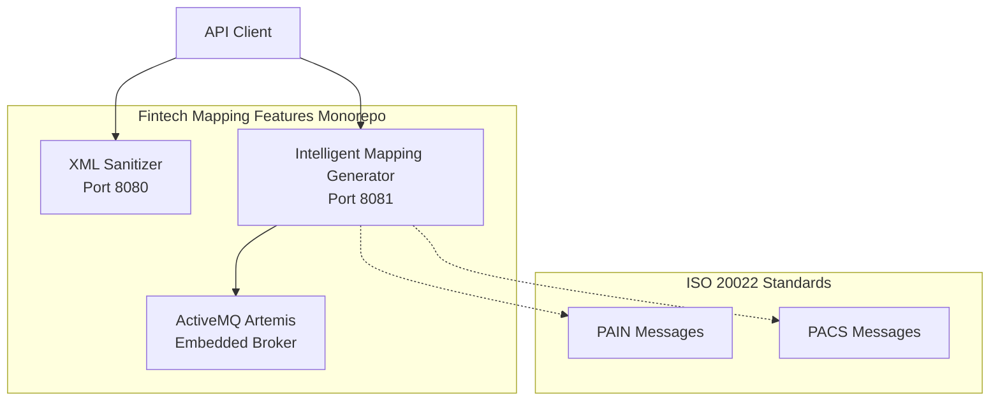

# System Architecture

Understanding the fintech-mapping-features monorepo architecture and design principles.

## High-Level Architecture



## Monorepo Structure

The project follows a **Gradle multi-module** architecture:

```
fintech-mapping-features/
├── build.gradle                 # Parent build configuration
├── settings.gradle              # Module registry
├── xml-sanitizer/              # Module 1
│   ├── src/
│   │   ├── main/java/com/fintech/sanitizer/
│   │   └── main/resources/
│   └── build.gradle
├── intelligent-mapping-generator/  # Module 2
│   ├── src/
│   │   ├── main/java/com/fintech/mapping/
│   │   └── main/resources/
│   └── build.gradle
└── schemas/iso20022/           # Shared ISO 20022 XSD files
```

## Module Independence

Each microservice is **independently deployable**:

| Feature | XML Sanitizer | Mapping Generator |
|---------|--------------|-------------------|
| Port | 8080 | 8081 |
| Database | None | None (In-memory) |
| Messaging | N/A | Artemis (Embedded) |
| Dependencies | Minimal | Artemis, JAXB |
| Startup Time | ~5s | ~8s |

## Technology Stack

### Core Framework
- **Spring Boot 3.2.1**: Modern application framework
- **Java 21**: Latest LTS with virtual threads support
- **Gradle 8.x**: Build automation

### API Layer
- **Spring Web MVC**: RESTful API controllers
- **SpringDoc OpenAPI**: Automatic API documentation
- **Swagger UI**: Interactive API explorer

### Messaging (Mapping Generator)
- **ActiveMQ Artemis 2.31.2**: High-performance message broker
- **Jakarta JMS**: Standard messaging API
- **Embedded Mode**: Zero external dependencies

### XML Processing
- **JAXB**: XML-Java binding
- **Jakarta XML Binding**: Modern XML standards
- **XSD Validation**: Schema-based validation

## Communication Patterns

### Synchronous (REST)
```
Client → HTTP POST → XML Sanitizer → HTTP Response
Client → HTTP POST → Mapping Generator → HTTP Response
```

### Asynchronous (JMS) - Internal
```
Mapping Service → JMS Queue → Message Processor
```

## Design Principles

### 1. Separation of Concerns
Each module has a single, well-defined responsibility:
- **XML Sanitizer**: Data cleaning
- **Mapping Generator**: Data transformation

### 2. Independent Deployment
Modules can be deployed separately without affecting each other.

### 3. ISO 20022 Compliance
All financial message processing follows ISO 20022 standards.

### 4. API-First Design
OpenAPI specifications drive development and documentation.

## Deployment Options

### Development (Local)
```bash
# Terminal 1
./gradlew :xml-sanitizer:bootRun

# Terminal 2
./gradlew :intelligent-mapping-generator:bootRun
```

### Production (Docker)
```bash
docker build -t xml-sanitizer:latest .
docker build -t mapping-generator:latest .

docker run -p 8080:8080 xml-sanitizer:latest
docker run -p 8081:8081 mapping-generator:latest
```

### Cloud (Kubernetes)
```yaml
apiVersion: apps/v1
kind: Deployment
metadata:
  name: xml-sanitizer
spec:
  replicas: 3
  selector:
    matchLabels:
      app: xml-sanitizer
  template:
    metadata:
      labels:
        app: xml-sanitizer
    spec:
      containers:
      - name: xml-sanitizer
        image: xml-sanitizer:latest
        ports:
        - containerPort: 8080
```

## Scalability Considerations

### Horizontal Scaling
- Both services are **stateless**
- Can run multiple instances behind a load balancer
- No session affinity required

### Performance Characteristics
- **XML Sanitizer**: ~50ms average response time
- **Mapping Generator**: ~200ms average response time (includes JMS processing)

## Security Considerations

### Current Implementation
- HTTP endpoints (development)
- No authentication (to be added)

### Recommended Enhancements
- Spring Security with OAuth 2.0
- API key authentication
- HTTPS/TLS encryption
- Rate limiting

## Monitoring & Observability

### Health Checks
Both services expose Spring Boot Actuator endpoints:
- `/actuator/health`
- `/actuator/info`
- `/actuator/metrics`

### Logging
- SLF4J with Logback
- Structured JSON logging (configurable)
- Log levels: DEBUG, INFO, WARN, ERROR

## Next Steps

- [Getting Started](../guides/getting-started)
- [Intelligent Mapping Generator](../intelligent-mapping-generator/overview)
- [XML Sanitizer](../xml-sanitizer/overview)
- [Back to Overview](/)
